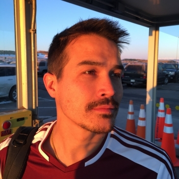

# KVeitch



As Former engineer and public school educator,  I have always been drawn to math, physics, and the science of building things. Putting all those pieces together, I graduated with a Bachelor of Science in Mechanical Engineering. I enjoyed being an educator at charter school and a part of a small engineering firm, where I worked in a variety of team roles.  I always found myself being pulled towards technology and programming. As my professional experience grew, I began to see how I could leverage my engineering, teaching, and problem solving background in new ways. This led me to the Turing School of Software and Design where I honed the skills necessary to be part of a dynamic software development team.

```javascript
const kirk = {
  pronouns: "he" | "him",
  code: [JavaScript, HTML, CSS],
  tools:[React, Redux, Node, Mocha, Chai, Jest, Adobe XD, Photoshop],
  currentChallenges: [#100DaysOfCode, typescript, Python],
}
```
  
  [](https://twitter.com/KirkVeitch)
  [](https://www.linkedin.com/in/kirkaveitch/)
  [](https://github.com/KVeitch)

  <p align="center" >
<a href="https://github.com/KVeitch/github-readme-stats"> 
    
  </a>

</p>